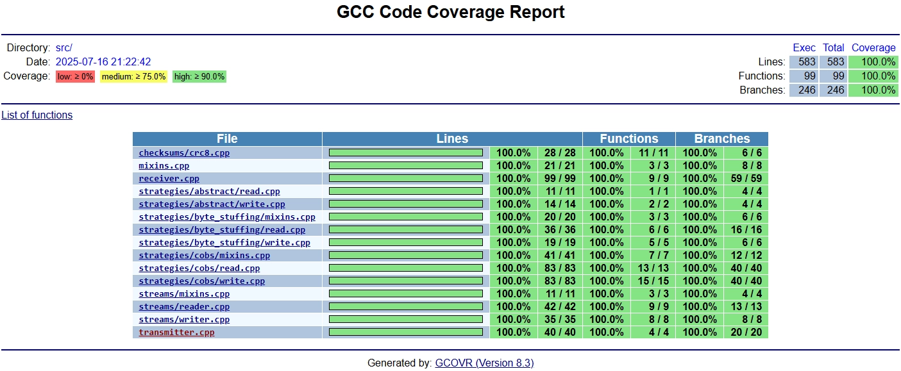
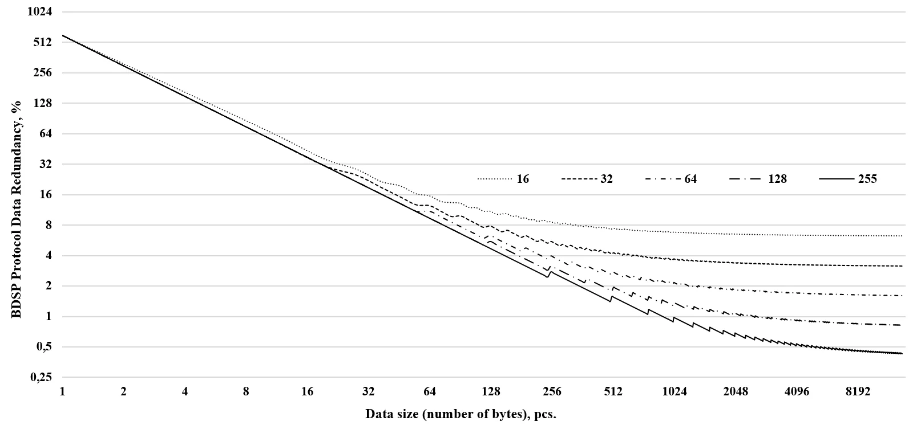

**BDSP** - Binary Data Separation Protocol
===========
[](https://registry.platformio.org/libraries/kobaproduction/BDSP)
[](https://github-com.translate.goog/KobaProduction/BDSP?_x_tr_sl=en&_x_tr_tl=ru)


The library implements a low-level packet data transfer protocol for byte communication channels 
(for example, UART, IP Socket). Such communication channels usually have only byte reading and writing 
methods, without the functionality of dividing the transmitted data stream into structural units (packets). 
The protocol is being developed to provide communication between Desktop applications and microcontrollers 
over the UART channel, but in the process it may begin to support other platforms, communication channels, 
and packet delivery methods.

Currently, the protocol implements binary data stream separation strategies based on byte insertion methods, 
specifically PPP and several modifications of COBS. COBS modification strategies include standard COBS, 
COBS/ZPE, as well as the author's modification of COBS/SR (information will be provided later). All strategies 
perform byte conversion for the communication channel on the fly, most of them do not require RAM buffers. 
The exception is all COBS strategies that send data to the communication channel, they require buffers that 
cannot exceed 255 bytes in size. COBS strategies that read a byte stream do not require buffers.

The choice of COBS strategies is appropriate when it is necessary to ensure a fixed and predictable redundancy 
of the transmitted data over the communication channel. In all other cases, the choice of PPP is most justified 
due to the complete absence of the need to use buffers, as well as lower computational loads when encoding and 
decoding bytes of the stream.

We have multiple goals with this library:
* Relative ease of use with high ability to configure and modify the protocol. It will not be easy for beginners;
* Latency-free asynchronous architecture. Data processing involves the use of callback functions and handler functions 
that pass through a pointer with the ability to pass a pointer to the context;
* Complete absence of external dependencies. All components are implemented within the protocol for portability 
and use on any platform;
* High performance, optimization of protocol algorithms;
* Possibility of flexible configuration;
* The ability to provide low and predictable data redundancy based on COBS methods..

# Code coverage at library version 0.2.1



[Instructions on how to set up an environment for assessing code coverage.](docs/coverage.md)


## BDSP Data redundancy with COBS (default) 

Parameters 16, 32, 64, 128, 255 are the delimiter byte search depth parameter. Redundancy is indicated in the worst case.

For a better understanding of the causes of redundancy, study the COBS method in detail. 
For COBS/SR, the search depth is limited to 127 bytes, for COBS/ZPE - 224. Graphs will be added later.
The redundancy of generated data in PPP strategies is in the range of 0-100%.

The redundancy of the protocol itself is formed due to the constant component of the packet: identifier (1 byte), 
data size (2 bytes), checksum (1 byte), as well as redundancy of the strategies used.

## Getting Started

Here's a simple program for ESP32 Platformio (Arduino Framework):

```cpp
#see link
```
[Example code link](examples/PlatformIO/main.cpp)

## Supported Platforms

Due to the fact that the library does not use external dependencies, it can be used on any platform. 
However, the emphasis in the development is on embedded systems, including Arduino-compatible platforms.

Unfortunately, we had to abandon the structure of the Arduino IDE libraries, because they do not allow you to use
the CMake assembly, without which it is impossible to make libraries for all platforms, as well as add them to
package managers. However, Platformio is supported, we highly recommend all embedded developers to abandon the
Arduino IDE and move to more professional environments (e.g. CLion or VSCode with the Platformio plugin). For those
who can't give up Arduino, we'll add instructions later, and possibly scripts for creating library archives for
the Arduino IDE.

To be able to use it on any platform, we need help improving the current build configuration of the CMake library.
We also need help writing instructions for building and using libraries on Desktop apps.

The current state was achieved through the [library example](https://github.com/pananton/cpp-lib-template) of `pananton`.